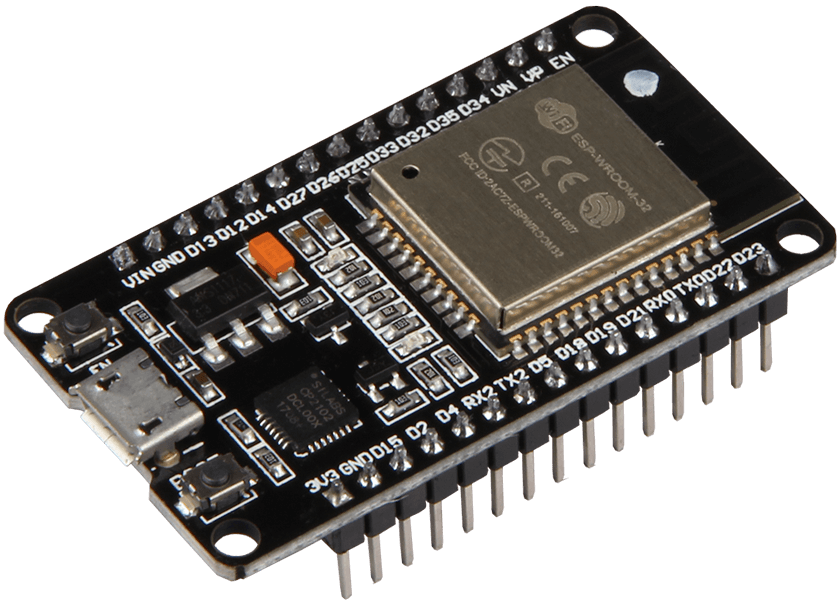

<h1 align="center">ESP32 😎❤</h1>

    

# Por que em C++? 🤔👀
Tendo em vista que a IDE Arduino utiliza a linguagem C++ porém com algumas modificações, o código foi totalmente desenvolvido para o ESP32.

    

 

# Como funciona o código? 📐🤨
O código conecta com a rede WiFi registrada, e em intervalos regulares de tempo ele envia dados para a api, dados esses como a umidade, se as válvulas solenoides estão ativa ou não e etc, caso a umidade esteja abaixo de um valor pré-definido pelo programa ele enviara os dados para api ao mesmo tempo que ele molha a terra, sendo assim este, de tempos irregulares.
